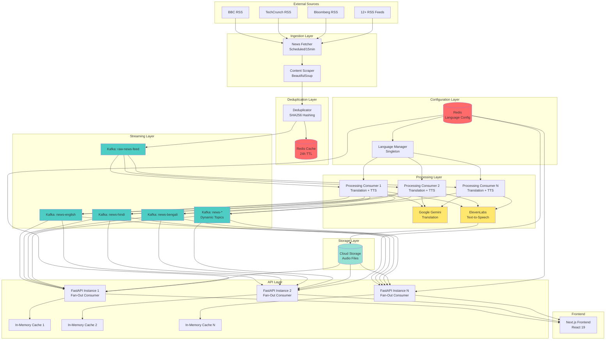
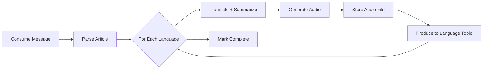
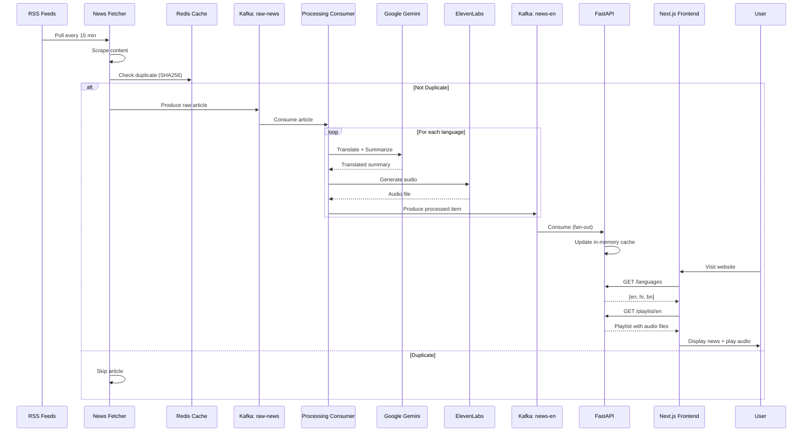
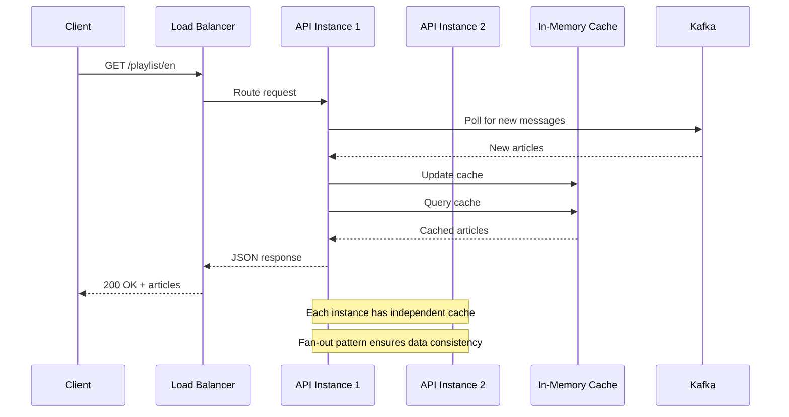
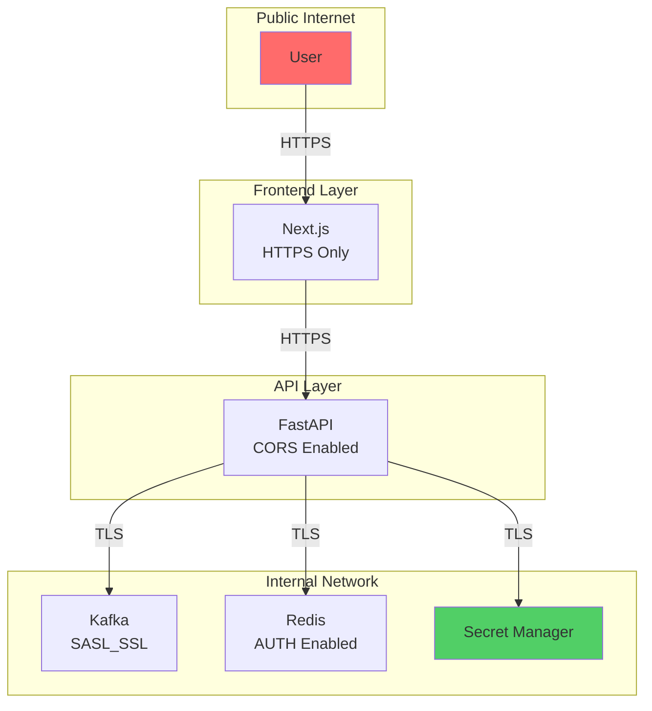
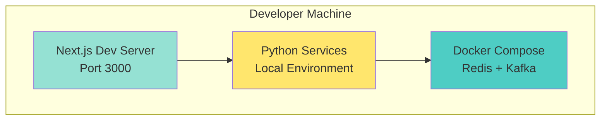
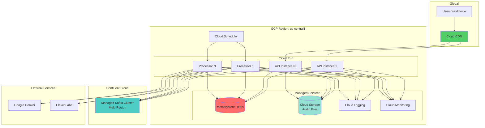

# 🏛️ System Architecture

> Comprehensive architectural overview of Multilingual News Radio

**Version**: 2.0.0  
**Last Updated**: December 28, 2024

---

## 📋 Table of Contents

1. [High-Level Architecture](#-high-level-architecture)
2. [Component Details](#-component-details)
3. [Data Flow](#-data-flow)
4. [Technology Stack](#-technology-stack)
5. [Scalability & Performance](#-scalability--performance)
6. [Security Architecture](#-security-architecture)
7. [Deployment Architecture](#-deployment-architecture)
8. [Design Decisions](#-design-decisions)

---

## 🎯 High-Level Architecture

### System Overview Diagram



---

## 🔧 Component Details

### 1. Ingestion Layer

#### News Fetcher
- **Language**: Python 3.13
- **Framework**: Custom with feedparser
- **Schedule**: Every 15 minutes (configurable)
- **Sources**: 12+ RSS feeds across 4 categories
- **Concurrency**: Single instance with sequential fetching
- **Rate Limiting**: 2-second delay between feeds

**Key Features:**
- Retry logic (3 attempts)
- Content scraping with fallback
- Published date parsing
- Image extraction

**Code Location:** `services/news_fetcher.py`

#### Content Scraper
- **Libraries**: BeautifulSoup4, Newspaper3k
- **Strategy**: Multi-layer extraction
  1. Try newspaper3k (best for news)
  2. Fallback to BeautifulSoup
  3. Use RSS description as last resort
- **Anti-blocking**: Rotating user agents
- **Timeout**: 30 seconds per article

**Code Location:** `services/content_scraper.py`

---

### 2. Deduplication Layer

#### Redis Cache
- **Version**: Redis 7
- **TTL**: 24 hours (configurable)
- **Key Format**: `news:seen:{hash}`
- **Hash Algorithm**: SHA256(url + title)
- **Purpose**: Prevent duplicate articles across sources

**Memory Estimates:**
- ~100 bytes per cached article
- ~500 articles/day = 50KB
- ~15,000 articles/month = 1.5MB

**Code Location:** `services/deduplicator.py`

---

### 3. Streaming Layer

#### Apache Kafka
- **Version**: Confluent Platform 7.5.0
- **Protocol**: SASL_SSL (production)
- **Replication**: 3 replicas (production)
- **Partitions**: 3 per topic

**Topics:**

| Topic | Partitions | Retention | Purpose |
|-------|------------|-----------|---------|
| `raw-news-feed` | 3 | 7 days | Untranslated articles |
| `news-english` | 3 | 30 days | English broadcasts |
| `news-hindi` | 3 | 30 days | Hindi broadcasts |
| `news-bengali` | 3 | 30 days | Bengali broadcasts |
| `news-*` | 3 | 30 days | Dynamic language topics |

**Message Format:**
```json
{
  "id": "abc123",
  "title": "Article Title",
  "content": "Full content...",
  "url": "https://...",
  "category": "technology",
  "source": "TechCrunch",
  "published_date": "2024-12-28T10:00:00Z"
}
```

**Producer Configuration:**
- `acks=all` - Wait for all replicas
- `compression=gzip` - Reduce bandwidth
- `batch.size=32KB` - Batch messages
- `linger.ms=100` - Wait 100ms for batching

**Consumer Configuration:**
- `auto.offset.reset=earliest` - Start from beginning
- `enable.auto.commit=true` - Auto-commit offsets
- `session.timeout.ms=6000` - 6 second timeout

---

### 4. Processing Layer

#### Processing Consumer
- **Instances**: 2-5 (auto-scaling)
- **Consumer Group**: `news-processing-group`
- **Concurrency**: Multi-threaded per instance
- **Throughput**: ~100 articles/hour per instance

**Processing Pipeline:**


**Code Location:** `processing_consumer.py`

#### Google Gemini
- **Model**: gemini-2.5-flash
- **Purpose**: Translation + Summarization
- **Input**: Original article (up to 5000 chars)
- **Output**: 
  - English summary (~150 chars)
  - Translated summary in target language
- **Latency**: ~2-3 seconds per article
- **Cost**: $0.00003/1K chars

**Code Location:** `services/translation_service.py`

#### ElevenLabs TTS
- **Model**: eleven_multilingual_v2
- **Voices**: Custom per language
  - English: George (natural, clear)
  - Hindi: Fin (multilingual)
  - Bengali: Fin (multilingual)
- **Input**: Translated summary (150-200 chars)
- **Output**: MP3 audio file (~30-60 seconds)
- **Latency**: ~3-5 seconds per file
- **Cost**: $0.30/1K characters

**Code Location:** `services/tts_service.py`

---

### 5. Configuration Layer

#### Language Manager
- **Type**: Singleton Pattern
- **Storage**: Redis (`config:languages`)
- **Refresh**: On-demand (no caching within instance)
- **Format**:
```json
{
  "en": {
    "name": "English",
    "flag": "🇬🇧",
    "voice_id": "JBFqnCBsd6RMkjVDRZzb",
    "enabled": true
  },
  "hi": {
    "name": "Hindi",
    "flag": "🇮🇳",
    "voice_id": "zs7UfyHqCCmny7uTxCYi",
    "enabled": true
  }
}
```

**Dynamic Features:**
- Add/remove languages without code changes
- Enable/disable languages on-the-fly
- Change voice assignments
- Auto-creates Kafka topics

**Code Location:** `services/language_manager.py`

---

### 6. API Layer

#### FastAPI Backend
- **Framework**: FastAPI 0.100+
- **Python**: 3.13+
- **ASGI Server**: Uvicorn
- **Instances**: 1-10 (auto-scaling)
- **Memory**: 2GB per instance
- **CPU**: 2 cores per instance

**Architecture Pattern:** Fan-Out Consumer

Each API instance:
1. Creates unique consumer group: `api-consumer-{uuid}`
2. Subscribes to all `news-*` topics using regex
3. Builds independent in-memory cache
4. Serves requests from local cache

**Why Fan-Out?**
- ✅ Every instance has complete data
- ✅ No cache coordination needed
- ✅ Fast local reads (no network calls)
- ✅ Horizontally scalable
- ❌ Higher memory usage (acceptable trade-off)

**In-Memory Cache:**
- **Structure**: `Dict[language_code, List[ProcessedNewsItem]]`
- **Size**: ~50 articles per language × 3 languages = ~150 articles
- **Memory**: ~5MB per instance
- **TTL**: Items sorted by date, keep latest 50

**Endpoints:** See [API.md](API.md) for details

**Code Location:** `main.py`

---

### 7. Storage Layer

#### Cloud Storage (Audio Files)
- **Type**: Google Cloud Storage (production)
- **Bucket**: Public read, private write
- **Lifecycle**: Delete after 30 days
- **CDN**: Cloud CDN (optional)
- **Format**: MP3 files
- **Size**: ~50KB per file
- **Daily Volume**: ~500 files = 25MB/day

**Alternative for Development:**
- Local filesystem: `audio_output/`

---

### 8. Frontend Layer

#### Next.js Application
- **Version**: Next.js 15
- **React**: React 19
- **Styling**: Tailwind CSS v4
- **Deployment**: Vercel or Cloud Run
- **Features**:
  - Server-side rendering
  - Dynamic language selector
  - Audio streaming player
  - Real-time playlist updates

**Code Location:** `frontend/`

---

## 🔄 Data Flow

### Complete Article Journey



### Request Flow (API)



---

## 🛠️ Technology Stack

### Backend

| Component | Technology | Version | Purpose |
|-----------|-----------|---------|---------|
| Runtime | Python | 3.13+ | Application runtime |
| Package Manager | uv | Latest | Dependency management |
| API Framework | FastAPI | 0.100+ | REST API |
| ASGI Server | Uvicorn | Latest | HTTP server |
| Message Queue | Apache Kafka | 7.5.0 | Event streaming |
| Cache | Redis | 7.0 | Deduplication + Config |
| HTTP Client | Requests | Latest | Web scraping |
| HTML Parser | BeautifulSoup4 | Latest | Content extraction |
| Article Parser | Newspaper3k | Latest | News extraction |

### AI/ML

| Service | Purpose | Model | Cost |
|---------|---------|-------|------|
| Google Gemini | Translation + Summarization | gemini-2.5-flash | $0.00003/1K chars |
| ElevenLabs | Text-to-Speech | eleven_multilingual_v2 | $0.30/1K chars |

### Frontend

| Component | Technology | Version | Purpose |
|-----------|-----------|---------|---------|
| Framework | Next.js | 15 | React framework |
| UI Library | React | 19 | UI components |
| Styling | Tailwind CSS | 4 | Utility-first CSS |
| Icons | Lucide React | Latest | Icon library |
| HTTP Client | Axios | Latest | API requests |
| Language | TypeScript | 5+ | Type safety |

### Infrastructure

| Component | Technology | Purpose |
|-----------|-----------|---------|
| Containers | Docker | Development isolation |
| Orchestration | Docker Compose | Local development |
| Cloud Platform | GCP | Production hosting |
| Compute | Cloud Run | Serverless containers |
| Message Queue | Confluent Cloud | Managed Kafka |
| Cache | Memorystore | Managed Redis |
| Storage | Cloud Storage | Audio files |
| Logging | Cloud Logging | Centralized logs |
| Monitoring | Cloud Monitoring | Metrics & alerts |

---

## 📈 Scalability & Performance

### Current Performance (MVP)

| Metric | Value | Notes |
|--------|-------|-------|
| Articles/Day | ~500 | 12 sources × 10 articles × 15-min intervals |
| Audio Generated/Day | ~1500 | 500 articles × 3 languages |
| API Latency (p95) | ~200ms | In-memory cache |
| Processing Latency | ~10s | Per article (translation + TTS) |
| Storage Used/Day | ~25MB | Audio files |

### Scaling Strategy

#### Horizontal Scaling

**News Fetcher:**
- Single instance (scheduled job)
- Not a bottleneck (~2min to fetch all)

**Processing Consumer:**
```
1 instance  = 100 articles/hour
5 instances = 500 articles/hour
10 instances = 1000 articles/hour
```
- Scale based on consumer lag
- Auto-scale in Cloud Run

**API Backend:**
```
1 instance  = 1000 req/sec
5 instances = 5000 req/sec
10 instances = 10000 req/sec
```
- Scale based on CPU/memory
- Auto-scale in Cloud Run

#### Vertical Scaling

**Processing Consumer:**
- Memory: 2GB → 4GB (more concurrent processing)
- CPU: 2 cores → 4 cores (parallel TTS generation)

**API Backend:**
- Memory: 2GB → 4GB (larger cache)
- CPU: 2 cores → 4 cores (more concurrent requests)

### Bottleneck Analysis

| Component | Bottleneck | Solution |
|-----------|------------|----------|
| Gemini API | Rate limits (60 req/min) | Batch requests, add retry |
| ElevenLabs | Rate limits (50 req/min) | Queue system, add retry |
| Kafka | Consumer lag | Scale consumers |
| Redis | Memory limits | Increase instance size |
| API Cache | Stale data | Reduce Kafka poll interval |

### Optimization Opportunities

1. **Batch AI Requests**: Group multiple articles per API call
2. **Pre-warm Cache**: Cache popular categories
3. **CDN for Audio**: Reduce API load
4. **Database for Metadata**: Move from cache to persistent store
5. **GraphQL API**: Reduce over-fetching

---

## 🔒 Security Architecture

### Current Security (MVP)



### Security Measures

#### 1. API Security

**Implemented:**
- ✅ HTTPS only (TLS 1.2+)
- ✅ CORS configuration
- ✅ Input validation (Pydantic)
- ✅ Rate limiting (planned)

**Planned:**
- 🔄 API key authentication
- 🔄 JWT bearer tokens
- 🔄 Request signing
- 🔄 IP whitelist

#### 2. Data Security

**In Transit:**
- TLS 1.2+ for all connections
- SASL_SSL for Kafka
- Redis AUTH password

**At Rest:**
- Cloud Storage encryption (AES-256)
- Redis encryption at rest (Memorystore)

**Secrets Management:**
- GCP Secret Manager
- Environment variables for development
- No secrets in code or Git

#### 3. Network Security

**Firewall Rules:**
```
Frontend → API: Allow HTTPS (443)
API → Kafka: Allow 9092, 9093
API → Redis: Allow 6379
API → Gemini: Allow HTTPS (443)
API → ElevenLabs: Allow HTTPS (443)
Everything else: Deny
```

**Internal Network:**
- VPC peering for GCP services
- Private IPs for Redis
- No public IP for processing consumers

#### 4. Application Security

**Code Security:**
- Dependency scanning (uv pip audit)
- Regular updates
- Input sanitization
- SQL injection prevention (N/A - no SQL)
- XSS prevention (React auto-escapes)

**Logging Security:**
- No sensitive data in logs
- Structured logging (JSON)
- Log retention (30 days)

---

## 🚀 Deployment Architecture

### Local Development



### Production Deployment (GCP)



---

## 🤔 Design Decisions

### 1. Why Kafka over Redis Streams?

**Decision:** Apache Kafka

**Reasoning:**
- ✅ Better horizontal scalability
- ✅ Long-term message retention
- ✅ Multi-consumer support
- ✅ Industry standard
- ✅ Rich ecosystem (Connect, Streams)
- ❌ More complex to operate

**Alternatives Considered:**
- Redis Streams: Simpler but less scalable
- RabbitMQ: Good but less suited for streaming
- AWS SQS: Cloud lock-in

---

### 2. Why Fan-Out Consumer Pattern?

**Decision:** Each API instance builds independent cache

**Reasoning:**
- ✅ Fast reads (no network calls)
- ✅ Simple implementation
- ✅ No cache coordination needed
- ✅ Scales horizontally
- ❌ Higher memory usage (acceptable)

**Alternatives Considered:**
- Shared Redis cache: Network latency, complexity
- Database: Slower, added complexity
- External cache service: More dependencies

---

### 3. Why Redis for Language Config?

**Decision:** Redis key-value store

**Reasoning:**
- ✅ Fast reads (<1ms)
- ✅ Already in architecture
- ✅ Simple data structure
- ✅ No schema migrations
- ✅ Atomic updates
- ❌ Not persistent (but backed up)

**Alternatives Considered:**
- PostgreSQL: Overkill for key-value
- Config files: Requires deployment to update
- Environment variables: Not dynamic

---

### 4. Why Google Gemini over OpenAI?

**Decision:** Google Gemini 2.5 Flash

**Reasoning:**
- ✅ Better multilingual support
- ✅ Faster (flash model)
- ✅ Cheaper ($0.00003 vs $0.0005/1K)
- ✅ Structured output support
- ❌ Newer, less battle-tested

**Alternatives Considered:**
- OpenAI GPT-4: More expensive
- Claude: Good but more expensive
- Open-source models: Lower quality

---

### 5. Why ElevenLabs over Google TTS?

**Decision:** ElevenLabs Multilingual v2

**Reasoning:**
- ✅ Superior voice quality
- ✅ Natural-sounding speech
- ✅ Good multilingual support
- ✅ Custom voice options
- ❌ More expensive ($0.30 vs $0.004/1K)

**Alternatives Considered:**
- Google Cloud TTS: Cheaper but robotic
- AWS Polly: Good but less natural
- Azure TTS: Similar quality, similar price

---

## 📊 System Metrics

### Resource Requirements

| Component | CPU | Memory | Storage | Network |
|-----------|-----|--------|---------|---------|
| News Fetcher | 1 core | 512MB | 1GB | 10 Mbps |
| Processing Consumer | 2 cores | 2GB | 5GB | 20 Mbps |
| API Backend | 2 cores | 2GB | 1GB | 50 Mbps |
| Frontend | 1 core | 512MB | 1GB | 10 Mbps |

### Cost Estimates (Monthly)

| Service | Usage | Cost/Month |
|---------|-------|------------|
| Cloud Run (API) | 1M requests | ~$10 |
| Cloud Run (Processor) | 15K hours | ~$30 |
| Confluent Kafka | Basic cluster | ~$360 |
| Memorystore Redis | 1GB instance | ~$40 |
| Cloud Storage | 50GB + bandwidth | ~$10 |
| Gemini API | 15M chars/month | ~$0.45 |
| ElevenLabs | 50K chars/month | ~$15 |
| **Total** | | **~$465/month** |

---

## 🔮 Future Architecture

### Planned Improvements

1. **Database Layer**
   - Add PostgreSQL for persistent storage
   - Store article metadata, user data
   - Enable complex queries

2. **Caching Layer**
   - Add Redis cluster for API caching
   - Implement cache warming
   - Edge caching with CDN

3. **Search Layer**
   - Add Elasticsearch for full-text search
   - Enable semantic search with embeddings
   - Category and tag filtering

4. **Analytics Layer**
   - Add BigQuery for analytics
   - User behavior tracking
   - Content performance metrics

5. **Real-time Updates**
   - WebSocket support for live updates
   - Server-sent events for notifications
   - Real-time article count updates

---

**Architecture Document maintained by**: Engineering Team  
**Last Updated**: December 28, 2024  
**Next Review**: January 28, 2025