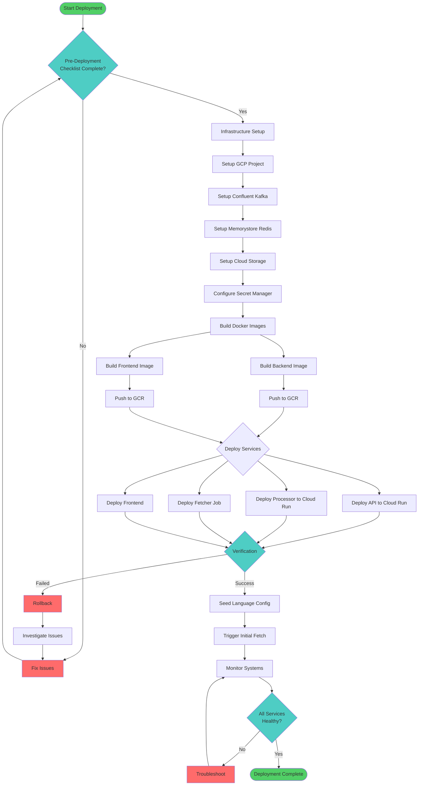
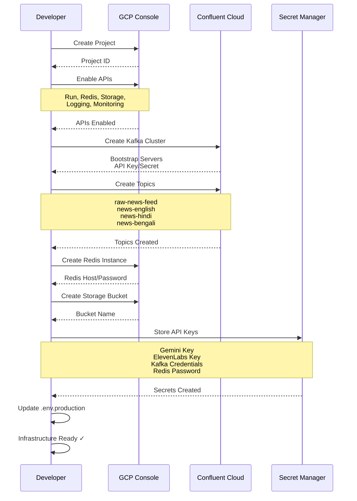
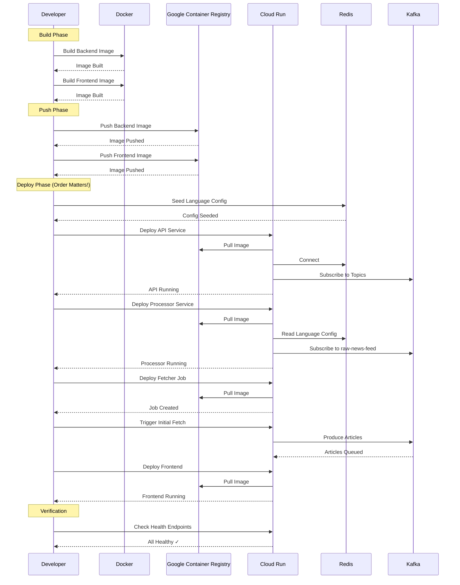
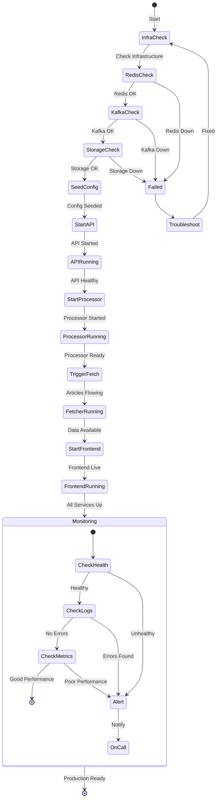
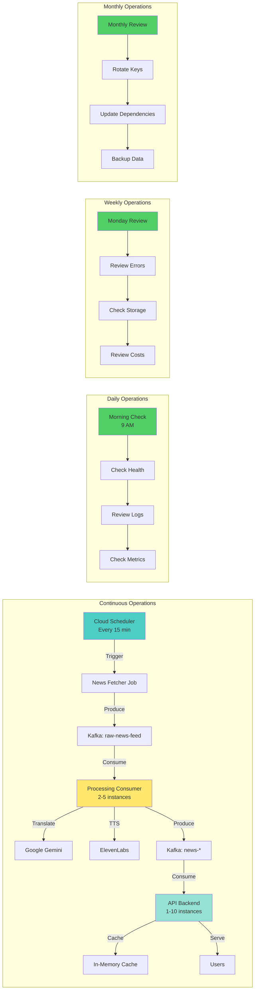
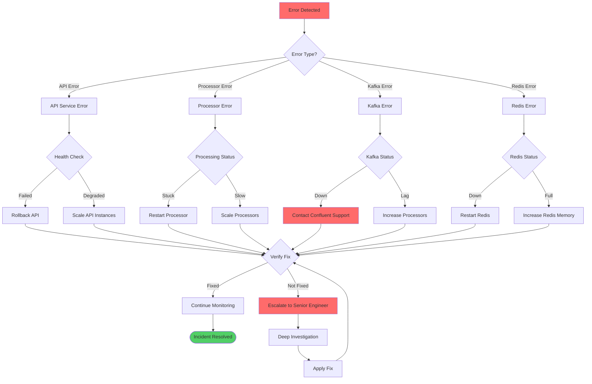
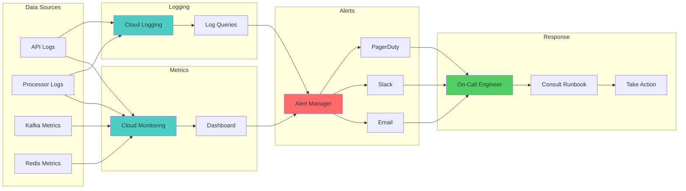

# 🚀 Production Deployment Guide

> Complete step-by-step guide for deploying Multilingual News Radio to production

**Target Platform**: Google Cloud Platform (GCP)  
**Last Updated**: December 28, 2024

---

## 📋 Table of Contents

1. [Pre-Deployment Checklist](#-pre-deployment-checklist)
2. [Infrastructure Setup](#-infrastructure-setup)
3. [Environment Configuration](#-environment-configuration)
4. [Deployment Sequence](#-deployment-sequence)
5. [Production Startup](#-production-startup)
6. [Business as Usual Operations](#-business-as-usual-operations)
7. [Monitoring & Maintenance](#-monitoring--maintenance)
8. [Rollback Procedures](#-rollback-procedures)
9. [Troubleshooting](#-troubleshooting)

---

## ✅ Pre-Deployment Checklist

### 1. Code Preparation

```bash
# Run full test suite
./run_tests.sh all

# Ensure all tests pass
# Expected: 100% pass rate

# Run linters
uv run black --check .
uv run flake8
uv run pylint services/

# Build frontend
cd frontend
npm run build
npm run lint
cd ..
```

### 2. Verify Dependencies

```bash
# Update dependencies
uv sync --upgrade

# Generate fresh requirements.txt
uv pip compile pyproject.toml -o requirements.txt

# Verify no security vulnerabilities
uv pip audit

# Check frontend dependencies
cd frontend
npm audit
npm audit fix
cd ..
```

### 3. Test with Production-like Settings

```bash
# Set production environment
export ENVIRONMENT=staging
export LOG_LEVEL=INFO
export TRANSLATION_PROVIDER=gemini
export TTS_PROVIDER=elevenlabs

# Test API keys
uv run python test_translation.py
uv run python test_voice.py

# Run integration tests
./run_tests.sh integration
```

### 4. Documentation Review

- [ ] README.md is up to date
- [ ] API documentation is current
- [ ] Environment variables documented
- [ ] Architecture diagrams updated
- [ ] Runbook created

### 5. Backup Strategy

- [ ] Database backup plan (Redis snapshots)
- [ ] Configuration backup (language config)
- [ ] Audio files backup strategy
- [ ] Rollback plan documented

---

## 🏗️ Infrastructure Setup

### Step 1: GCP Project Setup

```bash
# Install Google Cloud SDK
curl https://sdk.cloud.google.com | bash
exec -l $SHELL

# Initialize gcloud
gcloud init

# Create new project
export PROJECT_ID=multilingual-news-radio
gcloud projects create $PROJECT_ID --name="Multilingual News Radio"

# Set as active project
gcloud config set project $PROJECT_ID

# Enable required APIs
gcloud services enable \
  run.googleapis.com \
  redis.googleapis.com \
  secretmanager.googleapis.com \
  cloudlogging.googleapis.com \
  monitoring.googleapis.com \
  storage.googleapis.com
```

### Step 2: Confluent Cloud Kafka Setup

```bash
# Sign up for Confluent Cloud
# Visit: https://www.confluent.io/get-started/

# Create a new cluster
# Basic cluster is fine for start ($0.50/hr)

# Create topics manually (or enable auto-create):
# - raw-news-feed (3 partitions, 7 days retention)
# - news-english (3 partitions, 30 days retention)
# - news-hindi (3 partitions, 30 days retention)
# - news-bengali (3 partitions, 30 days retention)

# Create API key and secret
# Save these for later:
KAFKA_API_KEY=your_api_key
KAFKA_API_SECRET=your_api_secret
KAFKA_BOOTSTRAP_SERVERS=pkc-xxx.us-east-1.aws.confluent.cloud:9092
```

### Step 3: GCP Memorystore (Redis)

```bash
# Set region
export REGION=us-central1

# Create Redis instance
gcloud redis instances create news-redis \
  --size=1 \
  --region=$REGION \
  --redis-version=redis_7_0 \
  --tier=basic \
  --network=default \
  --enable-auth

# Get connection info
REDIS_HOST=$(gcloud redis instances describe news-redis \
  --region=$REGION --format="value(host)")
REDIS_PORT=6379
REDIS_PASSWORD=$(gcloud redis instances get-auth-string news-redis \
  --region=$REGION)

echo "Redis Host: $REDIS_HOST"
echo "Redis Port: $REDIS_PORT"
echo "Redis Password: $REDIS_PASSWORD"
```

### Step 4: Cloud Storage for Audio Files

```bash
# Create bucket for audio files
export BUCKET_NAME=${PROJECT_ID}-audio-files

gsutil mb -p $PROJECT_ID -l $REGION gs://${BUCKET_NAME}

# Set lifecycle policy (delete after 30 days)
cat > lifecycle.json << EOF
{
  "lifecycle": {
    "rule": [
      {
        "action": {"type": "Delete"},
        "condition": {"age": 30}
      }
    ]
  }
}
EOF

gsutil lifecycle set lifecycle.json gs://${BUCKET_NAME}

# Make bucket publicly readable (for audio streaming)
gsutil iam ch allUsers:objectViewer gs://${BUCKET_NAME}
```

### Step 5: Secret Manager

```bash
# Create secrets
echo -n "$GEMINI_API_KEY" | \
  gcloud secrets create gemini-api-key \
  --data-file=- \
  --replication-policy="automatic"

echo -n "$ELEVENLABS_API_KEY" | \
  gcloud secrets create elevenlabs-api-key \
  --data-file=- \
  --replication-policy="automatic"

echo -n "${KAFKA_API_KEY}:${KAFKA_API_SECRET}" | \
  gcloud secrets create kafka-credentials \
  --data-file=- \
  --replication-policy="automatic"

echo -n "$REDIS_PASSWORD" | \
  gcloud secrets create redis-password \
  --data-file=- \
  --replication-policy="automatic"
```

---

## ⚙️ Environment Configuration

### Production `.env` File

Create `.env.production`:

```bash
# ============================================
# ENVIRONMENT
# ============================================
ENVIRONMENT=production
LOG_LEVEL=INFO

# ============================================
# API KEYS (from Secret Manager)
# ============================================
GEMINI_API_KEY=${GEMINI_API_KEY}
ELEVENLABS_API_KEY=${ELEVENLABS_API_KEY}

# ============================================
# SERVICE PROVIDERS
# ============================================
TRANSLATION_PROVIDER=gemini
TTS_PROVIDER=elevenlabs

# ============================================
# KAFKA (Confluent Cloud)
# ============================================
KAFKA_BOOTSTRAP_SERVERS=${KAFKA_BOOTSTRAP_SERVERS}
KAFKA_CREDENTIALS=${KAFKA_API_KEY}:${KAFKA_API_SECRET}

# ============================================
# REDIS (GCP Memorystore)
# ============================================
REDIS_HOST=${REDIS_HOST}
REDIS_PORT=6379
REDIS_PASSWORD=${REDIS_PASSWORD}
REDIS_SSL=true
REDIS_DB=0
REDIS_TTL_HOURS=24

# ============================================
# APPLICATION
# ============================================
AUDIO_OUTPUT_DIR=/app/audio_output
MAX_WORKERS=4
FETCH_INTERVAL_MINUTES=15
ENABLE_DEDUPLICATION=true

# ============================================
# API
# ============================================
PORT=8080  # Cloud Run uses 8080
ALLOWED_ORIGINS=https://yourdomain.com

# ============================================
# FRONTEND
# ============================================
NEXT_PUBLIC_API_URL=https://api.yourdomain.com
```

---

## 🗺️ Deployment Flow Diagrams

### Overall Deployment Process



### Infrastructure Setup Flow



### Service Deployment Sequence



### Production Startup Sequence



### Business as Usual Operations



### Error Handling & Rollback Flow



### Monitoring Dashboard Flow



---

## 📦 Deployment Sequence

### Step 1: Build Docker Images

#### Backend Image

Create `Dockerfile`:

```dockerfile
# Dockerfile
FROM python:3.13-slim

# Set working directory
WORKDIR /app

# Install system dependencies
RUN apt-get update && apt-get install -y \
    gcc \
    g++ \
    librdkafka-dev \
    curl \
    && rm -rf /var/lib/apt/lists/*

# Install uv
RUN curl -LsSf https://astral.sh/uv/install.sh | sh
ENV PATH="/root/.cargo/bin:$PATH"

# Copy dependency files
COPY pyproject.toml requirements.txt ./

# Install Python dependencies
RUN uv pip install --system -r requirements.txt

# Copy application code
COPY . .

# Create directories
RUN mkdir -p logs audio_output

# Expose port (Cloud Run uses 8080)
EXPOSE 8080

# Health check
HEALTHCHECK --interval=30s --timeout=10s --start-period=5s --retries=3 \
  CMD curl -f http://localhost:8080/health || exit 1

# Default command (can be overridden)
CMD ["python", "main.py"]
```

Build and push:

```bash
# Build backend image
docker build -t gcr.io/${PROJECT_ID}/news-backend:latest .

# Push to Google Container Registry
docker push gcr.io/${PROJECT_ID}/news-backend:latest
```

#### Frontend Image

Create `frontend/Dockerfile`:

```dockerfile
# frontend/Dockerfile
FROM node:20-alpine AS builder

WORKDIR /app

# Copy package files
COPY package*.json ./

# Install dependencies
RUN npm ci

# Copy source code
COPY . .

# Build application
RUN npm run build

# Production image
FROM node:20-alpine

WORKDIR /app

# Copy built files
COPY --from=builder /app/.next ./.next
COPY --from=builder /app/node_modules ./node_modules
COPY --from=builder /app/package.json ./package.json
COPY --from=builder /app/public ./public

EXPOSE 3000

CMD ["npm", "start"]
```

Build and push:

```bash
cd frontend
docker build -t gcr.io/${PROJECT_ID}/news-frontend:latest .
docker push gcr.io/${PROJECT_ID}/news-frontend:latest
cd ..
```

### Step 2: Deploy Backend to Cloud Run

```bash
# Deploy API service
gcloud run deploy news-api \
  --image gcr.io/${PROJECT_ID}/news-backend:latest \
  --platform managed \
  --region $REGION \
  --allow-unauthenticated \
  --set-env-vars ENVIRONMENT=production,LOG_LEVEL=INFO \
  --set-secrets \
    GEMINI_API_KEY=gemini-api-key:latest,\
    ELEVENLABS_API_KEY=elevenlabs-api-key:latest,\
    KAFKA_CREDENTIALS=kafka-credentials:latest,\
    REDIS_PASSWORD=redis-password:latest \
  --memory 2Gi \
  --cpu 2 \
  --timeout 300 \
  --concurrency 80 \
  --min-instances 1 \
  --max-instances 10 \
  --port 8080

# Get API URL
API_URL=$(gcloud run services describe news-api \
  --region $REGION \
  --format="value(status.url)")

echo "API URL: $API_URL"
```

### Step 3: Deploy Processing Consumer

```bash
# Deploy processing consumer (different command)
gcloud run deploy news-processor \
  --image gcr.io/${PROJECT_ID}/news-backend:latest \
  --platform managed \
  --region $REGION \
  --no-allow-unauthenticated \
  --command python \
  --args processing_consumer.py,--mode,continuous \
  --set-env-vars ENVIRONMENT=production,LOG_LEVEL=INFO \
  --set-secrets \
    GEMINI_API_KEY=gemini-api-key:latest,\
    ELEVENLABS_API_KEY=elevenlabs-api-key:latest,\
    KAFKA_CREDENTIALS=kafka-credentials:latest,\
    REDIS_PASSWORD=redis-password:latest \
  --memory 4Gi \
  --cpu 4 \
  --timeout 3600 \
  --min-instances 2 \
  --max-instances 5
```

### Step 4: Deploy News Pipeline (Cloud Scheduler)

Create Cloud Run job:

```bash
# Create Cloud Run job for news fetching
gcloud run jobs create news-fetcher \
  --image gcr.io/${PROJECT_ID}/news-backend:latest \
  --region $REGION \
  --command python \
  --args news_pipeline.py,--mode,once \
  --set-env-vars ENVIRONMENT=production,LOG_LEVEL=INFO \
  --set-secrets \
    KAFKA_CREDENTIALS=kafka-credentials:latest,\
    REDIS_PASSWORD=redis-password:latest \
  --memory 2Gi \
  --cpu 2 \
  --task-timeout 600

# Create Cloud Scheduler job (runs every 15 minutes)
gcloud scheduler jobs create http news-fetcher-schedule \
  --location $REGION \
  --schedule "*/15 * * * *" \
  --uri "https://${REGION}-run.googleapis.com/apis/run.googleapis.com/v1/namespaces/${PROJECT_ID}/jobs/news-fetcher:run" \
  --http-method POST \
  --oauth-service-account-email ${PROJECT_ID}@appspot.gserviceaccount.com
```

### Step 5: Deploy Frontend

```bash
# Deploy frontend
gcloud run deploy news-frontend \
  --image gcr.io/${PROJECT_ID}/news-frontend:latest \
  --platform managed \
  --region $REGION \
  --allow-unauthenticated \
  --set-env-vars NEXT_PUBLIC_API_URL=${API_URL} \
  --memory 512Mi \
  --cpu 1 \
  --min-instances 1 \
  --max-instances 3 \
  --port 3000

# Get frontend URL
FRONTEND_URL=$(gcloud run services describe news-frontend \
  --region $REGION \
  --format="value(status.url)")

echo "Frontend URL: $FRONTEND_URL"
```

### Step 6: Configure Custom Domains (Optional)

```bash
# Map custom domain to API
gcloud run domain-mappings create \
  --service news-api \
  --domain api.yourdomain.com \
  --region $REGION

# Map custom domain to Frontend
gcloud run domain-mappings create \
  --service news-frontend \
  --domain yourdomain.com \
  --region $REGION

# Update DNS records as instructed by gcloud output
```

---

## 🚀 Production Startup

### Initial Deployment Sequence

**Order matters!** Follow this sequence:

#### 1. Infrastructure Verification

```bash
# Verify Redis is accessible
gcloud redis instances describe news-redis --region $REGION

# Verify Kafka cluster is running
# Check Confluent Cloud dashboard
```

#### 2. Seed Language Configuration

```bash
# Connect to a temporary Cloud Run instance
gcloud run services update news-api \
  --set-env-vars REDIS_HOST=$REDIS_HOST,REDIS_PASSWORD=$REDIS_PASSWORD

# Run seeding script locally or via Cloud Run job
gcloud run jobs execute language-seeder \
  --region $REGION \
  --wait
```

Or run locally:

```bash
# With production credentials
python scripts/seed_languages.py
```

#### 3. Start News Fetcher (Manual First Run)

```bash
# Trigger initial fetch manually
gcloud run jobs execute news-fetcher \
  --region $REGION \
  --wait

# Check logs
gcloud run jobs executions logs view latest \
  --job news-fetcher \
  --region $REGION
```

#### 4. Start Processing Consumer

```bash
# Service should auto-start when deployed
# Verify it's running
gcloud run services describe news-processor \
  --region $REGION

# Check logs
gcloud logging read \
  "resource.type=cloud_run_revision AND resource.labels.service_name=news-processor" \
  --limit 50 \
  --format json
```

#### 5. Start API Server

```bash
# Service should auto-start
# Verify health
curl ${API_URL}/health

# Expected response:
# {"status":"healthy","timestamp":"...","version":"2.0.0"}
```

#### 6. Verify Frontend

```bash
# Access frontend
open $FRONTEND_URL

# Verify API connection
curl ${FRONTEND_URL}/health
```

---

## 🔄 Business as Usual Operations

### Daily Operations

#### Morning Checks (9 AM)

```bash
# 1. Check service health
curl https://api.yourdomain.com/health

# 2. Check Cloud Run services status
gcloud run services list --platform managed --region $REGION

# 3. Check error rates
gcloud logging read \
  'severity>=ERROR' \
  --limit 20 \
  --format json

# 4. Check Kafka lag (Confluent Cloud dashboard)
# Navigate to: Consumers → View lag metrics

# 5. Check Redis memory
gcloud redis instances describe news-redis \
  --region $REGION \
  --format="value(currentMemoryUsageBytes)"
```

#### Article Processing (Continuous)

The system runs automatically:

1. **News Fetcher**: Runs every 15 minutes via Cloud Scheduler
2. **Processing Consumer**: Continuously processes from Kafka
3. **API**: Continuously serves requests

Monitor via:

```bash
# Check recent fetcher runs
gcloud scheduler jobs describe news-fetcher-schedule \
  --location $REGION

# Check processor instances
gcloud run services describe news-processor \
  --region $REGION \
  --format="value(status.traffic)"
```

### Weekly Maintenance

#### Monday Morning (Weekly Review)

```bash
# 1. Review error logs
gcloud logging read \
  'severity>=WARNING AND timestamp>="2024-01-01"' \
  --limit 100 \
  --format json > weekly_errors.json

# 2. Check storage usage
gsutil du -sh gs://${BUCKET_NAME}

# 3. Review Kafka metrics
# Check Confluent Cloud dashboard for:
# - Throughput
# - Consumer lag
# - Error rates

# 4. Check Redis memory trend
gcloud monitoring time-series list \
  --filter='metric.type="redis.googleapis.com/stats/memory/usage"'

# 5. Update dependencies (if needed)
# Test in staging first!
uv sync --upgrade
./run_tests.sh all
```

### Monthly Maintenance

```bash
# 1. Rotate API keys (if needed)
# Generate new keys in external services
# Update Secret Manager
gcloud secrets versions add gemini-api-key --data-file=-

# 2. Review and optimize costs
gcloud billing accounts get-costs-table \
  --billing-account=$BILLING_ACCOUNT_ID

# 3. Update base images
docker pull python:3.13-slim
docker pull node:20-alpine

# 4. Rebuild and redeploy
# Follow deployment sequence

# 5. Backup Redis data
gcloud redis instances export news-redis \
  --destination gs://${BUCKET_NAME}/backups/redis-$(date +%Y%m%d).rdb \
  --region $REGION
```

---

## 📊 Monitoring & Maintenance

### Key Metrics to Monitor

#### Application Metrics

```bash
# API response time (p95)
gcloud monitoring time-series list \
  --filter='metric.type="run.googleapis.com/request_latencies"'

# Error rate
gcloud monitoring time-series list \
  --filter='metric.type="run.googleapis.com/request_count" AND metric.labels.response_code_class="5xx"'

# Active instances
gcloud run services describe news-api \
  --region $REGION \
  --format="value(status.traffic[0].revisionName)"
```

#### Kafka Metrics (Confluent Cloud)

- Consumer lag: Should be < 1000 messages
- Throughput: Monitor for anomalies
- Error rate: Should be < 0.1%

#### Redis Metrics

```bash
# Memory usage
gcloud redis instances describe news-redis \
  --region $REGION \
  --format="value(currentMemoryUsageBytes)"

# Connected clients
# (Check via Redis CLI or Cloud Console)
```

### Setting Up Alerts

Create alerting policies:

```bash
# High error rate alert
gcloud alpha monitoring policies create \
  --notification-channels=$CHANNEL_ID \
  --display-name="High Error Rate" \
  --condition-display-name="Error rate > 5%" \
  --condition-threshold-value=0.05 \
  --condition-threshold-duration=300s

# High latency alert
gcloud alpha monitoring policies create \
  --notification-channels=$CHANNEL_ID \
  --display-name="High Latency" \
  --condition-display-name="P95 latency > 1s" \
  --condition-threshold-value=1000 \
  --condition-threshold-duration=300s
```

---

## 🔙 Rollback Procedures

### Immediate Rollback (Emergency)

```bash
# Rollback API to previous revision
PREVIOUS_REVISION=$(gcloud run revisions list \
  --service news-api \
  --region $REGION \
  --format="value(metadata.name)" \
  --limit=2 | tail -1)

gcloud run services update-traffic news-api \
  --to-revisions=$PREVIOUS_REVISION=100 \
  --region $REGION

# Verify
gcloud run services describe news-api \
  --region $REGION \
  --format="value(status.traffic)"
```

### Gradual Rollback (Canary)

```bash
# Route 90% to old version, 10% to new
gcloud run services update-traffic news-api \
  --to-revisions=$OLD_REVISION=90,$NEW_REVISION=10 \
  --region $REGION

# Monitor for 15 minutes
# If issues, route 100% to old version
# If stable, gradually increase new version traffic
```

### Database Rollback (Redis)

```bash
# Restore from backup
gcloud redis instances import news-redis \
  --source gs://${BUCKET_NAME}/backups/redis-20241220.rdb \
  --region $REGION
```

---

## 🔧 Troubleshooting

### API Not Responding

```bash
# 1. Check service status
gcloud run services describe news-api --region $REGION

# 2. Check recent logs
gcloud logging read \
  'resource.type=cloud_run_revision AND resource.labels.service_name=news-api' \
  --limit 50

# 3. Check health endpoint
curl https://api.yourdomain.com/health

# 4. Restart service (if needed)
gcloud run services update news-api \
  --region $REGION \
  --no-traffic  # Traffic split for rolling restart
```

### Processing Consumer Stuck

```bash
# 1. Check consumer lag (Confluent Cloud)

# 2. Check logs
gcloud logging read \
  'resource.labels.service_name=news-processor' \
  --limit 100

# 3. Restart service
gcloud run services update news-processor \
  --region $REGION \
  --max-instances 6  # Increase capacity temporarily
```

### High Latency

```bash
# 1. Check Cloud Run metrics
gcloud monitoring time-series list \
  --filter='metric.type="run.googleapis.com/request_latencies"'

# 2. Scale up if needed
gcloud run services update news-api \
  --max-instances 20 \
  --region $REGION

# 3. Check external dependencies
curl -w "@curl-format.txt" https://api.elevenlabs.io/v1/health
```

### Redis Connection Issues

```bash
# 1. Verify Redis instance
gcloud redis instances describe news-redis --region $REGION

# 2. Check network connectivity (from Cloud Run)
# Use Cloud Shell or debugging instance

# 3. Verify password is correct
gcloud secrets versions access latest --secret redis-password
```

---

## 📝 Runbook Summary

### Critical Incidents

**Severity 1 (P0)**: Total service outage

1. Check Cloud Run status
2. Check Redis availability
3. Check Kafka cluster (Confluent Cloud)
4. Review recent deployments
5. Consider immediate rollback
6. Escalate to on-call engineer

**Severity 2 (P1)**: Partial outage or degraded performance

1. Check error logs
2. Monitor metrics
3. Scale up services if needed
4. Investigate root cause
5. Plan fix deployment

**Severity 3 (P2)**: Non-critical issues

1. Create ticket
2. Schedule fix for next sprint
3. Monitor for escalation

### Contact Information

- **On-call Engineer**: Pagerduty/Slack
- **GCP Support**: [support.google.com/cloud](https://support.google.com/cloud)
- **Confluent Support**: [confluent.io/support](https://confluent.io/support)

---

## 🎓 Training Checklist for Operations Team

- [ ] Understand system architecture
- [ ] Know how to read logs in Cloud Logging
- [ ] Can check Kafka metrics in Confluent Cloud
- [ ] Can perform rollback procedure
- [ ] Understand Redis data structure
- [ ] Can add/remove languages
- [ ] Know escalation procedures
- [ ] Have tested runbook procedures

---

**Deployment guide maintained by**: DevOps Team  
**Last tested**: December 28, 2024  
**Next review**: January 28, 2025